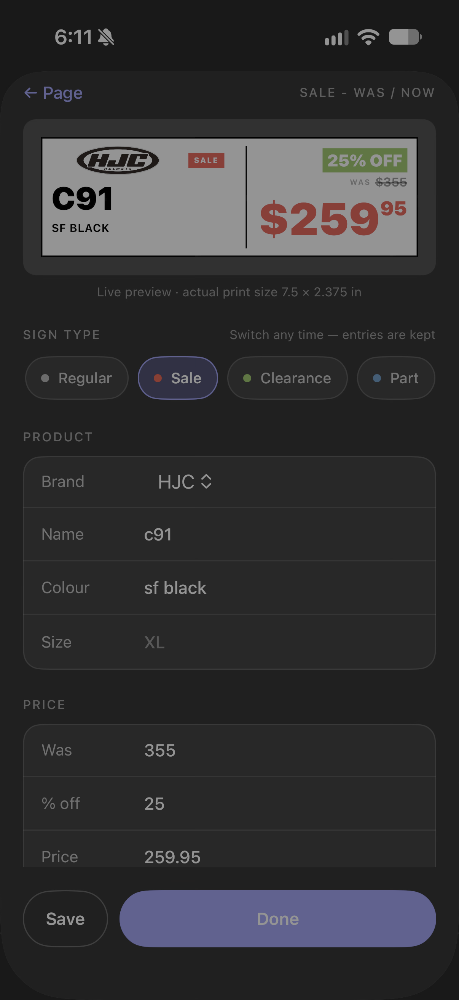

# PriceTag


PriceTag is an iOS app I built for a motorcycle dealership to make the price signs on the shop floor. You fill in a few fields, it lays out four signs on a US Letter page, and you print, laminate and cut them.

<p align="center">
  
  
  
</p>

## Why I built it

The store used to make signs in Word. Each batch was its own document, and adding a sign meant copying a text box and retyping everything around it. Font sizes drifted from sheet to sheet and nothing could be reused. I wanted something where staff could make a sign in under a minute and have it look the same as every other sign in the store.

## What it does

- Five sign types: Regular, Sale (was / now / % off), Clearance, Part with fitment, and Boots & apparel
- A live preview that matches the printed sign exactly
- Vector PDF export, shared through AirDrop, Print, Files or Mail
- A library for saving signs and reusing them on later pages
- Brand and feature logos that are trimmed and placed automatically
- No third-party dependencies

## How it works

**The preview is the print.** `SignFaceView` is built at real print size, 7.5 × 2.375 inches (540 × 171 points). On screen it's scaled down, and in the PDF it's drawn at full size. Since both come from the same view, I never had to keep two layouts in sync. The 540-point width also works out neatly: a Letter page is 612 points wide, and half-inch margins leave exactly 540.

**One model for every type.** There's a single `Sign` struct with all the fields any type might need. `SignType` decides which fields show up in the editor and on the sign, so a new type is mostly a new switch case. Older saved data still loads because a custom decoder maps retired type names to the current ones.

Prices are stored as strings. The app never does math on them, and storing text avoids `1178.95` turning into `1178.9499999`. Font sizes step down based on text length, so long model names shrink to fit instead of overflowing.

**PDF export.** `ImageRenderer` draws the SwiftUI view straight into a `UIGraphicsPDFRenderer` context, so text stays as vector text and files stay small. The two coordinate systems are flipped relative to each other, so each sign is translated to the bottom of its slot and drawn with a negative y scale.

**Logos.** Artwork lives in `Logos.bundle`, split into `Brands/` and `Features/`, with versioned filenames. Each image is downsampled, cropped to its visible pixels and cached when it loads, so extra padding in the source file doesn't shrink the logo on the sign. Wide logos go in the header and squarer ones go in the side gutter.

**Keeping it fast.** Early versions felt sluggish while typing because every keystroke rewrote the whole save file. Now the app waits 0.7 seconds after the last edit and saves in the background, with a final save when the app goes to the background. Signs are tracked by ID instead of position, which fixed a crash when deleting a sign mid-edit. Logo lookups are indexed, and the bigger screens are split into smaller views so SwiftUI compiles and redraws them faster.

## Project structure

```
PriceTagApp.swift     App entry point
Models.swift          Sign, SignPage, SignType
Store.swift           Data and saving
SignFaceView.swift    The sign itself, used on screen and in the PDF
PDFExport.swift       Puts four signs on a Letter page
LogoLibrary.swift     Loads, trims and caches logos
Theme.swift           Colours, fonts and shared controls
RootView.swift        Tab bar
PagesScreen.swift     List of saved pages
PageComposer.swift    The four-sign page editor
TypePicker.swift      Choose or change a sign's type
SignEditor.swift      Field editor with live preview
PrintPreview.swift    Full-page preview before sharing
LogosScreen.swift     Logo browser
OtherTabs.swift       Library and Templates
Logos.bundle/         Logo artwork
```

## Running it

You'll need Xcode 15 or later and a device or simulator on iOS 16+.

1. Clone the repo and open `PriceTag.xcodeproj`
2. Choose your team under Signing & Capabilities
3. Press ⌘R

## A few decisions

Everything is saved to one JSON file. It's one person on one iPhone, so a database or cloud sync would have been overkill.

The formatting rules live in the model, not the views, and they don't depend on UIKit. If the store ever wants an Android version, that part carries over as is.

If a page has fewer than four signs, the app repeats them to fill the sheet. Printing a half-empty page wastes laminate.

## Status

Staff at the dealership use it every day. It's installed directly from Xcode and isn't on the App Store.
